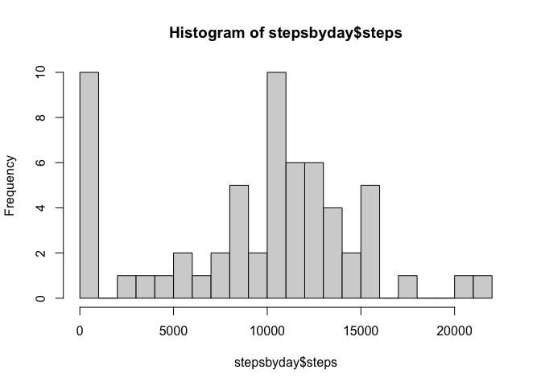
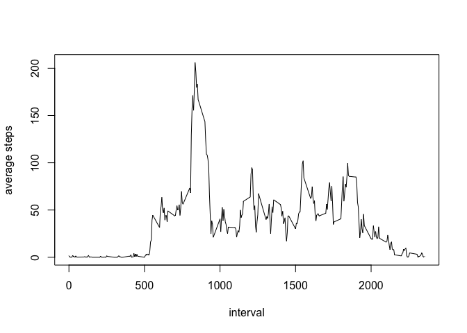
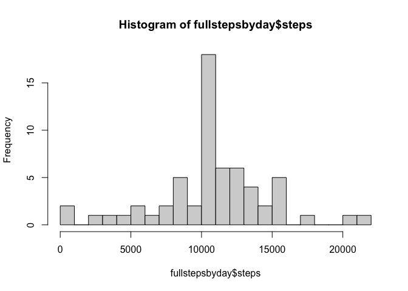
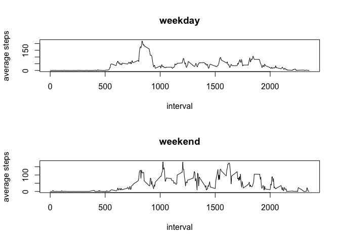

## Loading and preprocessing the data

This includes unzipping and reading the data, converting the date from 
a character string, converting the table to a data frame, and summarizing.


``` r
##getwd()
##list.files()
unzip("activity.zip")
list.files()
```

```
##  [1] "activity.csv"                  "activity.zip"                 
##  [3] "doc"                           "instructions_fig"             
##  [5] "PA1_template_files"            "PA1_template.html"            
##  [7] "PA1_template.md"               "PA1_template.Rmd"             
##  [9] "README.html"                   "README.md"                    
## [11] "RepData_PeerAssessment1.Rproj"
```

``` r
activity <- read.csv("activity.csv")
activity$date <- strptime(activity$date, format = "%Y-%m-%d")
activity <- as.data.frame(activity)
summary(activity)
```

```
##      steps             date                           interval     
##  Min.   :  0.00   Min.   :2012-10-01 00:00:00.00   Min.   :   0.0  
##  1st Qu.:  0.00   1st Qu.:2012-10-16 00:00:00.00   1st Qu.: 588.8  
##  Median :  0.00   Median :2012-10-31 00:00:00.00   Median :1177.5  
##  Mean   : 37.38   Mean   :2012-10-31 00:25:34.43   Mean   :1177.5  
##  3rd Qu.: 12.00   3rd Qu.:2012-11-15 00:00:00.00   3rd Qu.:1766.2  
##  Max.   :806.00   Max.   :2012-11-30 00:00:00.00   Max.   :2355.0  
##  NA's   :2304
```

Next load dplyr, group activity by date and interval, and calculate values.


``` r
library(dplyr)
```

```
## 
## Attaching package: 'dplyr'
```

```
## The following objects are masked from 'package:stats':
## 
##     filter, lag
```

```
## The following objects are masked from 'package:base':
## 
##     intersect, setdiff, setequal, union
```

``` r
days <- group_by(activity, date)
stepsbyday <- summarize(days, steps = sum(steps, na.rm = TRUE))
intervals <- group_by(activity, interval)
averagebyinterval <- summarize(intervals, steps = mean(steps, na.rm = TRUE))
```

## What is mean total number of steps taken per day?

Before calculating the mean and median, create a histogram.


``` r
hist(stepsbyday$steps, breaks = 25)
```

<!-- -->

Mean

``` r
mean(stepsbyday$steps)
```

```
## [1] 9354.23
```

Median

``` r
median(stepsbyday$steps)
```

```
## [1] 10395
```

## What is the average daily activity pattern?

Plot the average number of steps as a function of time averaged across all 
days in the data set.


``` r
xvals <- averagebyinterval$interval
yvals <- averagebyinterval$steps
plot(xvals, yvals, xlab = "interval", ylab = "average steps", type = "l")
```

<!-- -->

To identify the interval with the maximum average steps, we need the index of 
the row the the maximum average steps, and the associated interval.

``` r
index <- order(averagebyinterval$steps, decreasing = T)[1]
intervalwmaxsteps <- averagebyinterval[index,1]
intervalwmaxsteps
```

```
## # A tibble: 1 × 1
##   interval
##      <int>
## 1      835
```

## Imputing missing values

Before deciding how to replace missing values, look at which values are missing.

``` r
missingbyday <- summarize(days, missing = mean(is.na(steps)))
summary(missingbyday)
```

```
##       date                           missing      
##  Min.   :2012-10-01 00:00:00.00   Min.   :0.0000  
##  1st Qu.:2012-10-16 00:00:00.00   1st Qu.:0.0000  
##  Median :2012-10-31 00:00:00.00   Median :0.0000  
##  Mean   :2012-10-31 00:25:34.43   Mean   :0.1311  
##  3rd Qu.:2012-11-15 00:00:00.00   3rd Qu.:0.0000  
##  Max.   :2012-11-30 00:00:00.00   Max.   :1.0000
```

Since it looks like whole days are missing rather than some intervals from 
multiple days, we'll use the mean for the five-minute interval and look again 
at which values are missing.

``` r
m <- dim(activity)[1]

fullactivity <- activity

for(i in 1:m) {
  if(is.na(fullactivity[i,1])==TRUE) {
    intervalindex <- which(averagebyinterval$interval==fullactivity[i,3])
    fullactivity[i,1] <- averagebyinterval[intervalindex,2]
  }
}

fulldays <- group_by(fullactivity, date)
nomissingbyday <- summarize(fulldays, missing = mean(is.na(steps)))
summary(nomissingbyday)
```

```
##       date                           missing 
##  Min.   :2012-10-01 00:00:00.00   Min.   :0  
##  1st Qu.:2012-10-16 00:00:00.00   1st Qu.:0  
##  Median :2012-10-31 00:00:00.00   Median :0  
##  Mean   :2012-10-31 00:25:34.43   Mean   :0  
##  3rd Qu.:2012-11-15 00:00:00.00   3rd Qu.:0  
##  Max.   :2012-11-30 00:00:00.00   Max.   :0
```

Now we can create a new histogram and recalculate the mean and median.


``` r
fullstepsbyday <- summarize(fulldays, steps = sum(steps, na.rm = TRUE))
hist(fullstepsbyday$steps, breaks = 25)
```

<!-- -->

Mean

``` r
mean(fullstepsbyday$steps)
```

```
## [1] 10766.19
```

Median

``` r
median(fullstepsbyday$steps)
```

```
## [1] 10766.19
```


## Are there differences in activity patterns between weekdays and weekends?

First we need a function to determine from the day of the week is a weekday or 
on the weekend, then we need to add the day of the week to the dataframe, and 
apply the function.


``` r
f <- function(x) {
  if(x=="Saturday") {
    x <- "weekend"
  }
  if(x=="Sunday") {
    x <- "weekend"
  }
  else {
    x <- "weekday"
  }
}

fullactivity <- mutate(fullactivity, dayend = weekdays(date))
fullactivity$dayend <- lapply(fullactivity$dayend, f)
head(fullactivity)
```

```
##       steps       date interval  dayend
## 1 1.7169811 2012-10-01        0 weekday
## 2 0.3396226 2012-10-01        5 weekday
## 3 0.1320755 2012-10-01       10 weekday
## 4 0.1509434 2012-10-01       15 weekday
## 5 0.0754717 2012-10-01       20 weekday
## 6 2.0943396 2012-10-01       25 weekday
```

Now filter by weekday or weekend, group by date, calculate the average for each 
interval, and plot the average steps as a function of interval for weekdays and 
weekends.


``` r
fullweekday <- filter(fullactivity, dayend == "weekday")
fullweekend <- filter(fullactivity, dayend == "weekend")

fulldayinter <- group_by(fullweekday, interval)
fullendinter <- group_by(fullweekend, interval)

avgbyfulldayint <- summarize(fulldayinter, steps = mean(steps, na.rm = TRUE))
avgbyfullendint <- summarize(fullendinter, steps = mean(steps, na.rm = TRUE))

dayxvals <- avgbyfulldayint$interval
dayyvals <- avgbyfulldayint$steps
endxvals <- avgbyfullendint$interval
endyvals <- avgbyfullendint$steps
par(mfrow = c(2,1))
plot(dayxvals, dayyvals, xlab = "interval", ylab = "average steps", type = "l", 
     main = "weekday")
plot(endxvals, endyvals, xlab = "interval", ylab = "average steps", type = "l", 
     main = "weekend")
```

<!-- -->
